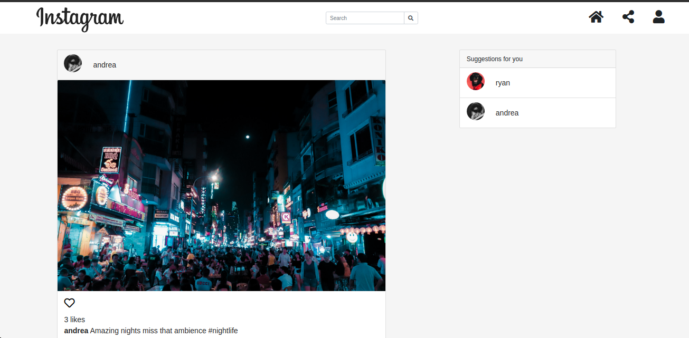

# Insta Clone
#### Insta Clone - a Django based carbon copy of the popular Instagram web app, 30/03/2021.
#### By Ryan Rotich

## Description
Insta Clone is a Django based carbon copy of the popular Instagram web app. 
Noteable features of the app include:
<table>
<tr>
<td>
1. More on the Description
Insta Clone is a clone app of Instagram. It is meant to emulate Instagram web app's functionalities and UI
 
2. User Authentication:
On this app a user can sign up for a profile, log into their account, update their profile with a bio and profile picture.
 
3. Image sharing with a Community access:
Post photos, search for and follow other users, view posts of people followed on the timeline, like and comment
 
4. More functionality on the Users: 
Users can also update captions of images they posted, delete their images, unfollow users, and even delete their profiles.
</td>
</tr>
</table> 

## Live link
Visit the application on  https://instagram-ryan.herokuapp.com/.

## Development
To make advancements/modifications, follow these steps:

- Fork the repository
- Create a new branch (`git checkout -b improve-feature`)
- Make the appropriate changes in the files
- Add changes made
- Commit your changes (`git commit -am 'Improve feature'`)
- Push to the branch (`git push origin improve-feature`)
- Create a Pull Request 

## Setup & Run instructions
- Create and activate a virtual environment
- Install the dependencies listed in the `requirements.txt`
- Create a `.env` file. This will contain environment variables as listed in the `.env.sample` file.
- Finally, run your app on `MODE='dev'` config for debugging purposes

## Technologies Used
Technologies used to develop this application:

1. Python v3.9.0
2. Django 3.0.7
3. Javascript
4. Cloudinary
5. Bootstrap
6. HTML 
7. CSS

## Future Works
1. Implement User(Profile Stories) in the app.
2. Work on polishing to truly emulate the Instagram web app.

## Support and contact details

Should you be unable to access the website, have any recommendations and/or questions, feel free to email me:[austinbrian005@gmail.com](mailto:austinbrian005@gmail.com)

### [License](LICENSE)
MIT license
Copyright (c) 2020 **Ryan Rotich**